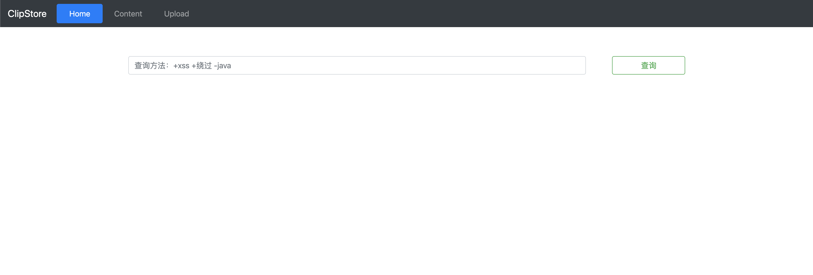
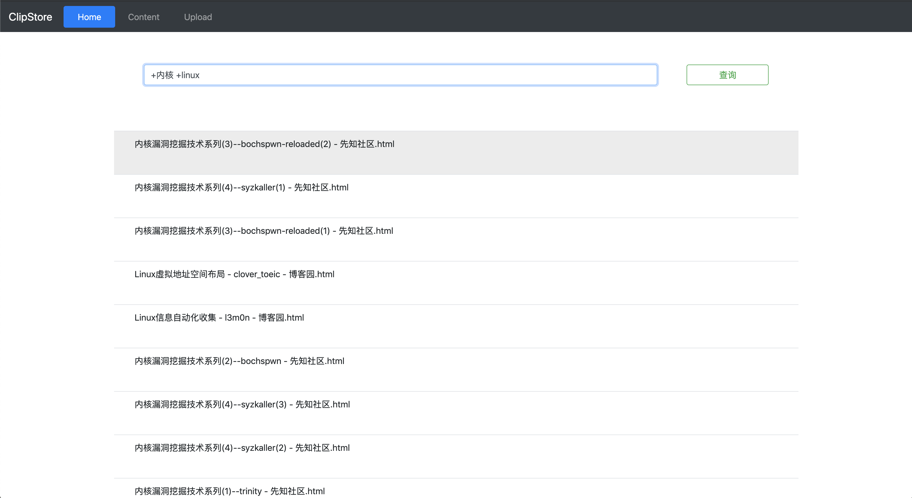
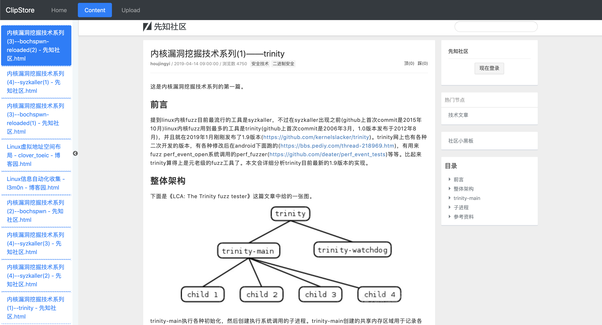
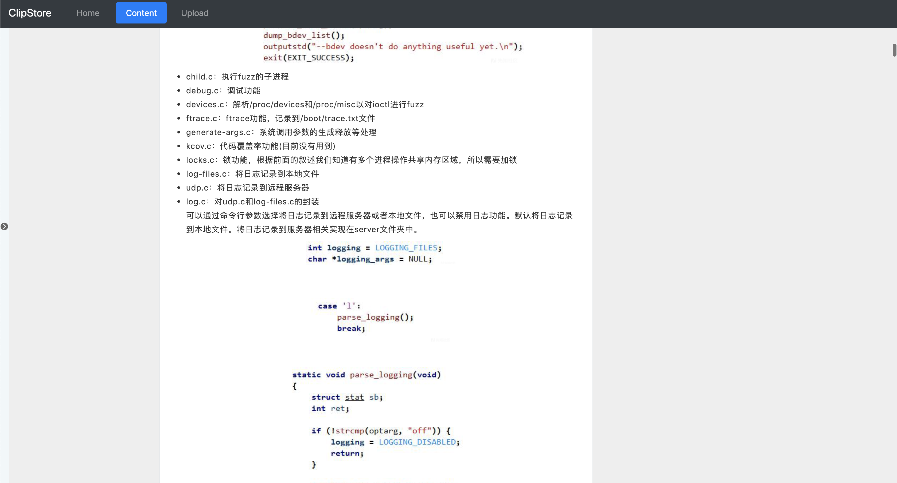

## 1.介绍
用于CTF线下参考的离线全文搜索工具。
配合Chrome插件[Save Page WE](https://chrome.google.com/webstore/detail/save-page-we/dhhpefjklgkmgeafimnjhojgjamoafof?hl=zh-CN)食用。

## 2.效果

界面:



搜索：



查看离线的网页内容：



缩略左侧搜索结果：



## 3.安装
创建数据库

``` sql
CREATE DATABASE ClipStore;
```
创建数据表
``` sql
CREATE TABLE articles CHARACTER SET utf8mb4 COLLATE utf8mb4_general_ci; (
    id INT UNSIGNED AUTO_INCREMENT NOT NULL PRIMARY KEY,
    title VARCHAR (200),
		file_path VARCHAR(500),
    body TEXT,
    FULLTEXT (title, body) WITH PARSER ngram
) ENGINE = INNODB;

CREATE FULLTEXT INDEX ft_index ON articles (title,body) WITH PARSER ngram;
```
修改数据库连接密码：
``` php
<!-- config.php -->

$servername = "127.0.0.1";
$username = "root";
$password = "root";
$dbname = "ClipStore";
```

## 3.用法：

用Chrome插件[Save Page WE](https://chrome.google.com/webstore/detail/save-page-we/dhhpefjklgkmgeafimnjhojgjamoafof?hl=zh-CN)将网页保存为html文本后丢到```./uploads```文件夹下即可。

TODO:
- ~~upload by file~~
- ~~upload by url~~
- 看板娘
- 爬取博客 lemon 离别歌 phithon 创宇 freebuf 安全客